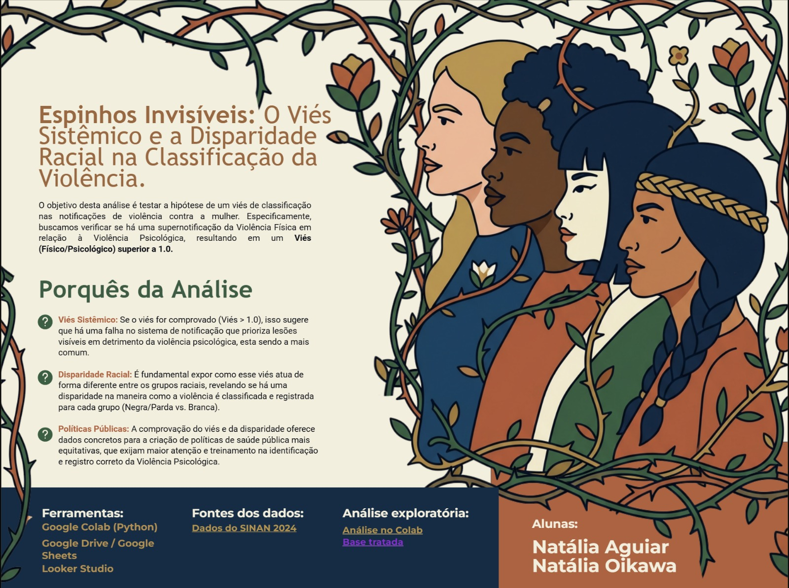
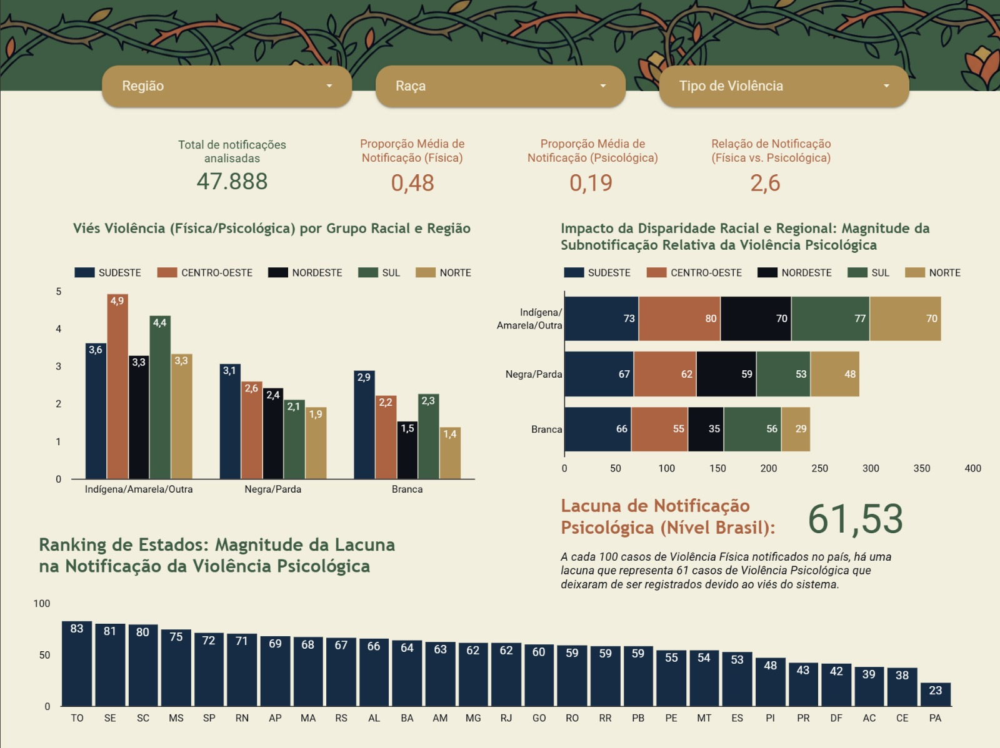

# 🥀 Espinhos Invisíveis: O Viés Sistêmico e a Disparidade Racial na Classificação da Violência

## 📌 Visão Geral
Este projeto analisa as notificações de violência contra a mulher no Brasil em 2024, utilizando os microdados do **SINAN (Sistema de Informação de Agravos de Notificação)**. 

A pesquisa investiga o hiato entre a **Violência Física** e a **Violência Psicológica**, revelando como o sistema de saúde brasileiro registra de forma distinta as agressões dependendo da raça/cor da vítima. O trabalho foi desenvolvido como projeto final no bootcamp de Análise de Dados da **{reprograme}**.

## 📊 Resultados da Análise (Dados Reais)
A análise de **47.888 registros** revelou uma verdade dolorosa: a dor que não deixa marcas visíveis é frequentemente silenciada pelo sistema.

### Principais Indicadores:
* **Viés de Notificação: 2,62** (O sistema é programado para priorizar a lesão física em detrimento da psicológica).
* **Lacuna de Notificação: 61,53** (A cada 100 casos de violência física notificados, há uma lacuna de 61 casos de violência psicológica que deixaram de ser registrados).
* **Disparidade Racial:** O viés de classificação atinge magnitudes críticas em mulheres **Indígenas (4,9)** e **Negras/Pardas (3,1)** em regiões como o Centro-Oeste, enquanto mulheres brancas apresentam índices significativamente menores.

## 🚀 Metodologia (CRISP-DM)
Para garantir rigor técnico, o projeto seguiu o modelo CRISP-DM:
1.  **Entendimento do Negócio:** Investigação sobre o racismo institucional e subnotificação.
2.  **Entendimento dos Dados:** Processamento de microdados governamentais.
3.  **Preparação dos Dados:** Limpeza e tratamento de dados com Python (Pandas).
4.  **Análise Exploratória:** Implementação de funções modulares e loops para análise regional automatizada.
5.  **Visualização:** Storytelling de dados com dashboards institucionais.

## 🛠️ Tecnologias Utilizadas
- **Linguagem:** Python (Pandas, NumPy, Matplotlib, Seaborn)
- **Visualização:** Looker Studio
- **Conceitos de Economia:** Estatística Descritiva, Economia da Saúde e Análise Interseccional.

## 🖼️ Visualização do Dashboard

---
### 🏆 Validação Acadêmica
> "Este trabalho tem potencial para ganhar ainda mais força e alcance, inclusive em espaços institucionais e de formulação de políticas públicas." — *Feedback da Banca Avaliadora*

---

## 🔗 Links do Projeto
* **Dashboard Interativo (Looker Studio):** [Clique aqui para acessar](https://lookerstudio.google.com/reporting/9bfe2e09-0929-4445-b6ff-f8e513558487)
* **Ambiente de Desenvolvimento (Google Colab):** [Clique aqui para visualizar o código](https://colab.research.google.com/drive/1KXLB_eNlTbgpusO0ziacSeAcU79JogO_?usp=sharing)

---

## 👥 Autoria e Colaboração
Projeto desenvolvido em dupla para o bootcamp da **{reprograma}**:
* **Natália Aguiar** - Análise de Dados, Desenvolvimento Python e Storytelling.

* **Natália Oikawa** - Pesquisa Estratégica, Revisão e Defesa do Projeto.

---

## 📫 Contato
Se você se interessa por dados sociais, políticas públicas ou quer trocar uma ideia sobre este projeto, sinta-se à vontade para me encontrar:

* **LinkedIn:** [Clique aqui para acessar meu perfil](https://www.linkedin.com/in/nataliaaguiars)
* **E-mail:** nah.aguiar911@gmail.com
